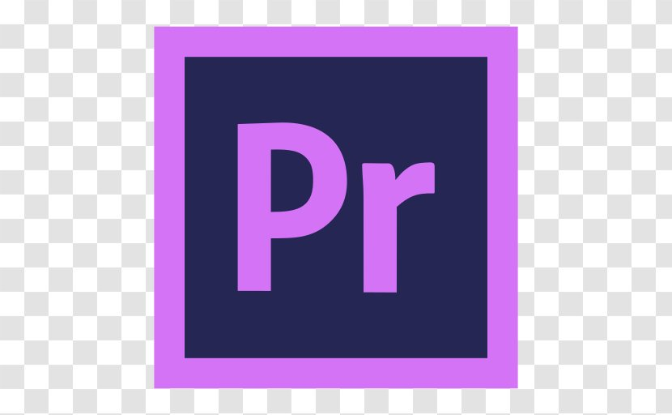

<h1 align="center"> Hi there , Ujjawal Kumar here.</h1>

  

## &nbsp;**_About me_**

I am an undergraduate Computer science and Engineering student. I love to learn and build something new, productive, innovative and creative.

- **I am interested in Web development, Android development, and Video editing**

* 🌱 I’m currently learning ...
  - Java
  - React js
* 👯 I’m looking forward to collaborate on open source projects.
* ✔ Ask me about anything, I am happy to help, only if the ball is in my court!😉 
* Outside tech, 📖 I love to listen to music 🎵 , and watch movies.
* 📫 Reach out to me at: <a href="kumar9ujjawwal2014@gmail.com">kumar9ujjawal2014@gmail.com</a>

 <h1> Languages| Frameworks| Library| Tools I work on...</h1>

  
  
  
  
  

 

<h1>
 &nbsp;<i><b>Github Repo Stats</b></i></h1>

&nbsp;

